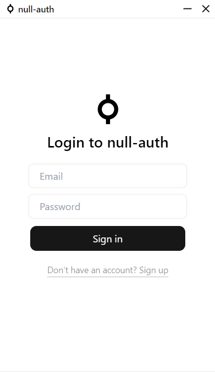
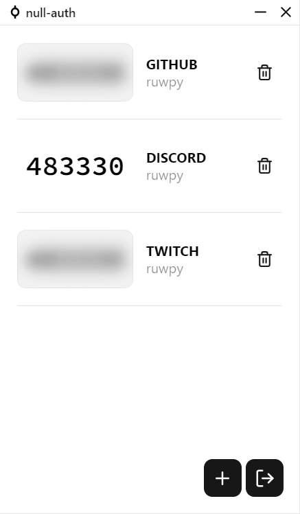

<h1 align="center">
  
   
  
null-auth

</h1>

<h3 align="center">
TOTP authentication client built with <a href="https://github.com/tauri-apps/tauri">tauri</a>.
</h3>

  

## Screenshots

  
  

## Download

Go to [release page](https://github.com/ruwpy/null-auth/releases)

## Todo

- [x] support export / import 2FA accounts
- [x] QR code scanning
- [x] offline mode
- [x] accounts backup
- [x] fix drag'n'drop on qr import
- [ ] QR code import from screen / webcam
- [ ] automatic updates
- [ ] add settings

## License

GPL-3.0 License. See [License](./LICENSE).
